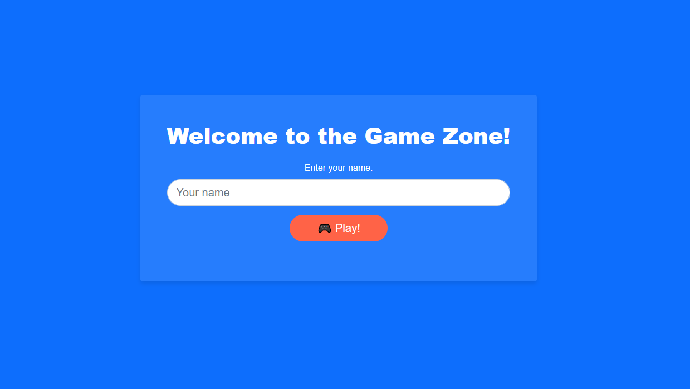
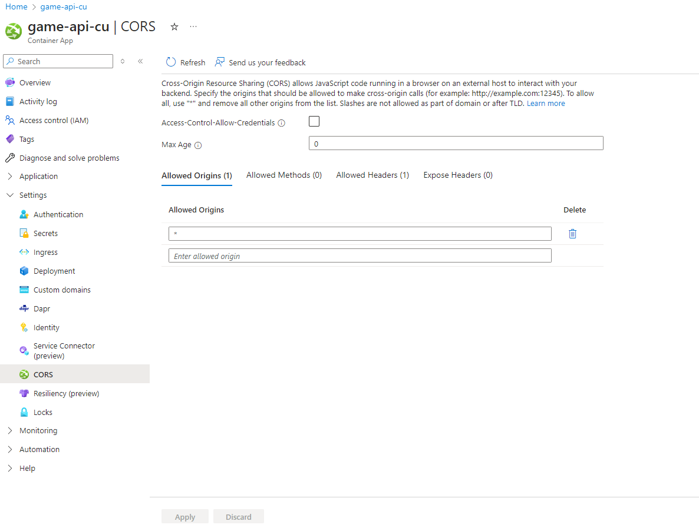

# Module 1 Exercise 1

In this exercise you will deploy a game of Rock, Paper, Scissors on a web app with two APIs, one for the game itself and
one for the bot that will be used to play the game with. The APIs will be deployed in two different regions and you will
connect both regions using a Front Door. At the end of the exercise you will be able to stop the resources from one of
the regions and the app will automatically reconnect to the other region.

## Estimated time: 50 minutes

## Learning objectives

- Deploy Container Apps and a Web App using ARM templates.
- Deploy and Configure a Front Door resource to connect two different regions to increase availability.
- Configure environment variables for Web Apps and Azure Container Apps.
- Configure Dapr statestore using CosmosDB.

## Prerequisites

The following steps are written for Azure PowerShell using variables and parameters to make the scripts flexible.

Throughout this exercise you will be required to name some of your resources and for this we advise you to read this [Azure documentation](https://learn.microsoft.com/en-us/azure/cloud-adoption-framework/ready/azure-best-practices/resource-naming) regarding Azure resources naming conventions.

During the entire exercise you can check your deployments or settings made from certain commands in the [Azure Portal](https://portal.azure.com/). We encourage
you to use the portal to monitor your deployments at any point.

The steps below with instructions correspond to the same steps in the [Exercise1.ps1](./Exercise1.ps1) script. Here you will find the commands to run in your terminal.

## Step 1: Create the resource group and deploy the ARM

1. Create your resource-group for APIs.
2. Create a resource-group for the database.
3. Set the variables used on deployment.
4. Deploy the ARM templates for the APIs and the database.
    A Container Apps environment is a secure boundary around one or more container apps and jobs. It provides isolation, network boundaries, and resource management for containerized applications.
    Here are some features and use cases for Container Apps environments:
    - Virtual Network: Each environment can be associated with a virtual network to enforce secure boundaries.
    - Multiple Container Apps: Multiple container apps within the same environment share the same virtual network and logging destination.
    - Multi-Service Integration: You can integrate Azure Functions and Azure Spring Apps within a Container Apps environment.
5. Deploy the ARM templates for the database.
    Azure Cosmos DB is a globally distributed, multi-model database service designed to provide high availability, low latency, and scalability. It supports multiple data models, including document, key-value, graph, and column-family data models. Here are some key features:
    - Global Distribution: Automatically replicates data across any number of Azure regions.
    - Multi-Model Support: Supports SQL, MongoDB, Cassandra, Gremlin, and Table APIs.
    - Guaranteed Low Latency: Offers single-digit millisecond response times.
    - High Availability: Provides 99.999% availability SLA for both reads and writes.
    - Elastic Scalability: Scales throughput and storage elastically and independently.

At the end of this step you can open [Azure Portal](https://portal.azure.com/) and see your deployed resources: Bot Container API, Game Container API, Container App Environment, Virtual Network and a Cosmos DB.

## Step 2: Create an Azure Static Web App

1. Deploy your static web app in the same Resource Group with the APIs.
2. Configure an environment variable to connect your Static Web App with your game Container Api.
3. At the end of this step you will be able to see your Static Web app deployed in [Azure Portal](https://portal.azure.com/) and you can even open your web app! It should look like this: 

## Step 3: Configure dapr statestore using Cosmos DB

1. Install az containerapp extension
2. Configuring statestore using **statestore.yaml** file from the local *infra* folder``
3. Open the file and edit the following variables: `<cosmos-url>` and `<cosmos-primary-key>`
    - `<cosmos-url> = Your Cosmos DB url`
    - `<cosmos-primary-key> = Your Cosmos DB primary key`
4. Update the Managed Environment

## Step 4: Configure environment variables for Azure Container Apps

1. Configure environment variable for Game Container Api
2. Configure environment variable for Bot Container Api

## Step 5: Deploy the second Container App on another region

1. Create the resource group
2. Create the environment
3. Update the Managed Environment
4. Create your second Container App and save its host name in a variable for later

## Step 6: Configure Front Door to connect both regions from bot Container Api
We will use [Azure Front Door](https://learn.microsoft.com/en-us/azure/frontdoor/front-door-overview) for routing the traffic between the two regions. In the event that one region becomes unavailable, Azure Front Door will seamlessly redirect traffic to the secondary region, ensuring continuity and reliability.

1. Create a new resource-group for Front Door
2. Create Azure Front Door profile
3. Create Azure Front Door endpoint
4. Create an origin group

Azure Front Door [origin groups](https://learn.microsoft.com/en-us/azure/frontdoor/origin?pivots=front-door-standard-premium) are a key feature of Azure Front Door that enable intelligent traffic management and high availability for your applications.

5. Create origins
   - Create first origin
   - Create second origin
6. Create Front Door route
7. List endpoint to get the Front Door link and save it on a variable

## Step 7: Configure Front Door to connect both regions from game Container Api

1. Create gameapi container on second region
2. Create another endpoint
3. Create a second origin group
4. Create origins
   - Create first game origin
   - Create second game origin
5. Create Front Door route for game
6. List second endpoint to get the Front Door link and save it on a variable

## Step 8: Use the endpoints to configure Azure Container Apps and Static Web

1. Modify environment variables for Azure Container Apps
2. Modify environment variables for Static Web App
3. Add `*` to **CORS** manually under **Settings** tab for Azure Container Apps created on second region from [Azure Portal](https://portal.azure.com/)

## Deploy Button

If you get stuck during the exercise you can use this button to deploy all the resources from this exercise:

After deploying all resources using the button you need to go through **step 9** to update environment variables for api containers and also do **step 6, point 4.**

List of Instance details for deploying with button:

- Region1_containerapps_bot_api_name = $botApi
- Region1_containerapps_game_api_name = $gameApi
- Region1_managed Environments_env_name = $managedEnvironment
- Location = $location
- Region2_containerapps_bot_api_name = $BotApi2
- Region2_containerapps_game_api_name = $GameApi2
- Region2_managed Environments_env_name = $ManagedEnvironment2
- Location2 = $Location2
- API Resource Group = $apiResourceGroup
- API Resource Group2 = $apiResourceGroup2
- Network Resource Group = $NetworkResourceGroup
- DB Resource Group = $dbResourceGroup
- Database Accounts_db_name = $cosmosDbAccount
- Profiles_frontdoor_name = $ProfileName
- Static Sites_test_web_rps_we_name = $staticWebName
- Repository Url = `Your Github Repository url`
- Branch = `The branch you want to use for deployment`
- Repository Token = `Your Github token (PAT) value`
- Endpointbot = $EndpointName
- Endpointgame = $EndpointName2
- Botgroup = $OriginGroupName
- Gamegroup = $OriginGroupName2
- Gameorigin1 = `First origin name for game`
- Gameorigin2 = `Second origin name for game`
- Botorigin1 = `First origin name for bot`
- Botorigin2 = `Second origin name for bot`
- Virtual Networks_vnet_name = $vnetName
- Environment-subnet-name = $EnvironmentSubnet
- Githubowner = $gitRepositoryOwner

## Testing your deployment

After deploying all the necessary resources, you can start testing your web application using the [Azure Portal](https://portal.azure.com/)!

You can play a game of Rock, Paper, Scissors with a bot or invite someone to play against you!

To test Azure Front Door, stop an API container in your first region (to simulate a regional failure) and then access the application, the web application should work using the API container in your second region!
