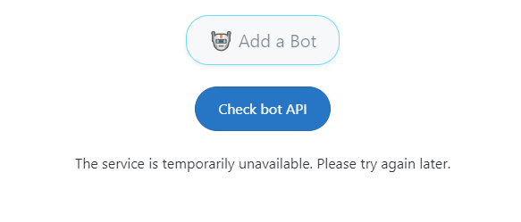

# Module 1 Exercise 2

## Estimated time: 20 minutes

## Simulate a server failure

1. In the Azure Portal, access the resource where the BotAPI is deployed.

2. Stop the resource from running to simulate a server overloading/failing.

   > [!IMPORTANT]
   > You need to stop both resources that you deployed for this exercise. Stopping only the main one will make the Azure Front Door to redirect to the other resource.

3. Try to play a game by inviting a bot. You won't be able to play the game as the bot you invited will never join. On a large scale application, this will mean that the users will flood the server with requests that the server won't be able to respond to.

To solve this problem, we will use a **Circuit Breaker** pattern inside our web application so after a few failed requests, the clients will limit the rate of sending additional requests to the server.

To solve this exercise you can either implement the Circuit Breaker yourself, or deploy the provided app with the implementation.

### **Method 1**: Implementing the [Circuit Breaker](https://learn.microsoft.com/en-us/dotnet/architecture/microservices/implement-resilient-applications/implement-circuit-breaker-pattern) pattern

1. First, clone the repository on your local machine(if you haven't yet). You will find the source code of exercise 1 and the start of exercise 2 at `module-1-azure-architecture-introduction/src/Exercise_1`.

2. Install the [Polly](https://www.nuget.org/packages/polly/) NuGet package in the RockPaperScissors project, so that you'll be able to implement the Circuit Breaker.

3. Inside the same project, open Services/BotService.cs. This will be where you will implement the logic for the Circuit Breaker.

4. Modify the code in the BotService class to implement the Circuit Breaker. It should look something like this:

````c#
public class BotService : IBotService
{
    private readonly HttpClient client;
    private LocalConfiguration _localConfiguration;
    private readonly AsyncCircuitBreakerPolicy<HttpResponseMessage> _circuitBreakerPolicy;
    public bool IsCircuitOpen { get; private set; }
    public string ErrorMessage { get; private set; } = string.Empty;

    private IConfiguration configuration;
    public BotService(HttpClient client, IConfiguration configuration, LocalConfiguration localConfiguration)
    {
        _circuitBreakerPolicy = Policy
            .Handle<HttpRequestException>()
            .OrResult<HttpResponseMessage>(response => !response.IsSuccessStatusCode)
            .CircuitBreakerAsync(
            handledEventsAllowedBeforeBreaking: 2,
            durationOfBreak: TimeSpan.FromSeconds(30),
            onBreak: (result, duration) =>
            {
                IsCircuitOpen = true;
                ErrorMessage = "The service is temporarily unavailable. Please try again later.";
            },
            onReset: () =>
            {
                IsCircuitOpen = false;
                ErrorMessage = string.Empty;
            },
            onHalfOpen: () =>
            {
                ErrorMessage = "Circuit is half-open; testing the next call.";
            }
        );
        _localConfiguration = localConfiguration;
        this.client = client;
        this.configuration = configuration;
    }

````

5. Now you should also modify the CheckBotAPI method so that the http call will be made using the Circuit Breaker. You need to modify the code inside FormPages.razor with the following example:

````c#
@page "/"
@using Microsoft.AspNetCore.WebUtilities
@using RockPaperScissors.Models
@using RockPaperScissors.Services
@using System.Net
@inject NavigationManager Navigation
@inject ISessionService _sessionService
@inject IBotService _botService
@inject Session GameSession
@inject IJSRuntime JS

<PageTitle>Game Zone</PageTitle>

<div class="hs-step-form overflow-hidden" style="min-height:100vh;">
    <div class="wizard-container mt-5" style="max-width: 1100px; margin: 0 auto; padding: 20px; border-radius: 15px; box-shadow: 0 10px 20px rgba(0, 0, 0, 0.1);">

        <ul id="stepFormProgress" class="step step-sm step-inline step-item-between mb-5 d-flex justify-content-center align-items-center flex-wrap">
            <li class="step-item">
                <a class="step-content-wrapper @GetStepClass(1)" style="text-decoration:none;" href="javascript:;">
                    <span class="step-icon step-icon-soft-dark rounded-circle" style="width: 40px; height: 40px;line-height: 40px; display: inline-block; text-align: center;">
                        1
                    </span>
                    <div class="step-content">
                        <span class="step-title" style="font-family: 'Segoe UI', sans-serif;">Player name</span>
                    </div>
                </a>
            </li>
            <li class="step-item">
                <a class="step-content-wrapper @GetStepClass(2)" style="text-decoration:none;" href="javascript:;">
                    <span class="step-icon step-icon-soft-dark rounded-circle" style="width: 40px; height: 40px;line-height: 40px; display: inline-block; text-align: center;">
                        2
                    </span>
                    <div class="step-content">
                        <span class="step-title" style="font-family: 'Segoe UI', sans-serif;">Rounds</span>
                    </div>
                </a>
            </li>
            <li class="step-item">
                <a class="step-content-wrapper @GetStepClass(3)" style="text-decoration:none;" href="javascript:;">
                    <span class="step-icon step-icon-soft-dark rounded-circle" style="width: 40px; height: 40px;line-height: 40px; display: inline-block; text-align: center;">
                        3
                    </span>
                    <div class="step-content">
                        <span class="step-title" style="font-family: 'Segoe UI', sans-serif;">Invite</span>
                    </div>
                </a>
            </li>
            <li class="step-item">
                <a class="step-content-wrapper @GetStepClass(4)" style="text-decoration:none;" href="javascript:;">
                    <span class="step-icon step-icon-soft-dark rounded-circle" style="width: 40px; height: 40px;line-height: 40px; display: inline-block; text-align: center;">
                        4
                    </span>
                    <div class="step-content">
                        <span class="step-title" style="font-family: 'Segoe UI', sans-serif;">Configurations</span>
                    </div>
                </a>
            </li>
        </ul>

        <div id="basicStepInfo" class="step h-100" style="display: block; transition: opacity 0.5s ease;">
            <h4 class="mb-4 mx-4" style="font-family:'Segoe UI', sans-serif; color: #2c3e50;">Enter your name</h4>
            <div class="full-page-container h-100 d-flex justify-content-center align-items-center">
                <div class="text-center p-3 p-md-5 rounded" style="opacity: 0.95; width: 100%; max-width: 900px;">
                    <div class="mb-0">
                        <InputText @bind-Value="name" id="nameInput" class="form-control form-control-lg" placeholder="John Doe"
                                   style="border-radius: 25px; border: 2px solid #ccc; padding: 15px; background-color: #f0f4f7; color: #2c3e50;" @onkeydown="HandleKeyPress" />
                    </div>
                    @if (!string.IsNullOrWhiteSpace(displayMessage))
                    {
                        <p class="lead mt-3" style="color: #2c3e50;">@displayMessage</p>
                    }
                </div>
            </div>
            <div class="d-flex align-items-center">
                <div class="ms-auto">
                    <button type="button" class="btn btn-primary" @onclick=" NextStep">
                        Next <i class="bi-chevron-right small" style="font-family: 'Segoe UI', sans-serif;"></i>
                    </button>
                </div>
            </div>
        </div>

        <div id="basicStepTerms" class="step h-100" style="display: none; transition: opacity 0.5s ease;">
            <h4 class="mb-4 mx-4" style="font-family: 'Segoe UI', cursive; color: #2c3e50;">Number of Rounds</h4>
            <div class="full-page-container h-100 d-flex justify-content-center align-items-center">
                <div class="text-center p-3 p-md-5 rounded" style="opacity: 0.95; width: 100%; max-width: 700px;">
                    <div class="d-flex flex-column align-items-center mb-5" style="width: 100%;">
                        <div class="input-group w-5">
                            <button class="btn btn-outline-secondary" @onclick="DecrementRounds">-</button>
                            <span class="form-control text-center w-50 w-lg-100"
                                  style="font-size: 1.1rem; padding: 10px; background-color: #f8f9fa; width: 80px;">
                                @numberOfRounds
                            </span>
                            <button class="btn btn-outline-secondary" @onclick="IncrementRounds">+</button>
                        </div>
                    </div>
                </div>
            </div>
            <div class="d-flex align-items-center">
                <button type="button" style="border-radius: 25px;background-color: #f0f4f7;color: #2c3e50;box-shadow: 0 2px 4px rgba(0, 0, 0, 0.1);" class="btn btn-ghost-secondary me-2" @onclick="PreviousStep">
                    <i class="bi-chevron-left small" style="font-family: 'Segoe UI', sans-serif;"></i> Previous step
                </button>

                <div class="ms-auto">
                    <button type="button" class="btn btn-primary" @onclick="CreateGameSession">
                        Next <i class="bi-chevron-right small" style="font-family: 'Segoe UI', sans-serif;"></i>
                    </button>
                </div>
            </div>
        </div>

        <div id="basicStepMembers" class="step h-100" style="display: none; transition: opacity 0.5s ease;">
            <h4 class="mb-4 mx-4" style="font-family: 'Segoe UI', sans-serif; color: #2c3e50;">Create Game Session</h4>
            <div class="full-page-container h-100 d-flex justify-content-center align-items-center">
                <div class="text-center p-5 rounded" style="opacity: 0.95;">

                    <div class="mb-4">
                        <div class="form-check" style="font-size: 1.25rem; padding: 10px;">
                            <input class="form-check-input" type="radio" name="gameOption" id="inviteFriendOption" value="inviteFriend" @onchange="OnOptionChanged" checked="@inviteFriendChecked" disabled="@inviteFriendDisabled" style="transform: scale(1.5);">
                            <label class="form-check-label" for="inviteFriendOption" style="padding-left: 10px; font-size: 1.25rem;">
                                🤝 Invite a Friend
                            </label>
                        </div>
                        <div class="form-check" style="font-size: 1.25rem; padding: 10px;">
                            <input class="form-check-input" type="radio" name="gameOption" id="addBotOption" value="addBot" @onchange="OnOptionChanged" disabled="@addBotDisabled" style="transform: scale(1.5);">
                            <label class="form-check-label" for="addBotOption" style="padding-left: 10px; font-size: 1.25rem;">
                                🤖 Add a Bot
                            </label>
                        </div>
                    </div>

                    <div class="mb-4">
                        @if (selectedOption == "inviteFriend")
                        {
                            <button class="btn btn-lg btn-warning w-40" @onclick="InviteFriend" style="border-radius: 30px; background-color: #f0f4f7; color: #2c3e50; box-shadow: 0 2px 4px rgba(0, 0, 0, 0.1);">
                                🤝 Invite a Friend
                            </button>
                        }
                        else if (selectedOption == "addBot")
                        {
                            <button class="btn btn-lg btn-info w-40" @onclick="AddBot" style="border-radius: 25px; background-color: #f0f4f7; color: #2c3e50; box-shadow: 0 2px 4px rgba(0, 0, 0, 0.1);" disabled="@(BotResult!=HttpStatusCode.OK)">
                                🤖 Add a Bot
                            </button>
                        }
                    </div>
                    @if (selectedOption == "addBot" && BotResult == HttpStatusCode.ServiceUnavailable)
                    {
                        <button class="btn btn-primary mb-4" @onclick="CheckBotAPI" type="button">Check bot API</button>
                    }
                    <div>
                    @errorMessage
                    </div>

                    @if (inviteLinkCreated)
                    {
                        <div class="row mb-4">
                            <div class="input-group">
                                <input type="text" class="form-control" value="@inviteLink" disabled style="background-color: #f8f9fa; color: #2c3e50;">
                                <div class="input-group-append">
                                    <button class="btn btn-primary" @onclick="CopyInviteLink" type="button" style="border-radius: 25px; background-color: #6c8cd5; color: white;">Copy</button>
                                </div>
                            </div>
                        </div>
                    }

                    @if (invited)
                    {
                        <div class="mb-4">
                            <button class="btn btn-lg btn-info w-40" @onclick="RefreshStatus" style="border-radius: 25px; background-color: #f0f4f7; color: #2c3e50; box-shadow: 0 2px 4px rgba(0, 0, 0, 0.1);">
                                Refresh status
                            </button>
                        </div>
                    }
                </div>
            </div>

            <div class="text-center d-flex justify-content-center">
                @if (playerJoined)
                {
                    <div class="alert alert-info" role="alert" style="background-color: #e0f7fa; color: #2c3e50;">
                        You can start the game.
                    </div>
                }
                else
                {
                    <div class="alert alert-info" role="alert" style="background-color: #e0f7fa; color: #2c3e50;">
                        You can't start the game until the other player joins the session.
                    </div>
                }
            </div>

            <div class="d-flex align-items-center">
                <button type="button" style="border-radius: 25px;background-color: #f0f4f7;color: #2c3e50;box-shadow: 0 2px 4px rgba(0, 0, 0, 0.1);" class="btn btn-ghost-secondary me-2" @onclick="PreviousStep2">
                    <i class="bi-chevron-left small" style="font-family: 'Segoe UI', sans-serif;"></i> Previous step
                </button>

                <div class="ms-auto">
                    <button type="button" disabled="@(!playerJoined)" class="btn btn-primary" @onclick="NextStep2">
                        Next <i class="bi-chevron-right small" style="font-family: 'Segoe UI', sans-serif;"></i>
                    </button>
                </div>
            </div>
        </div>

        <div id="basicStepConfigurations" class="step h-100" style="display: none; transition: opacity 0.5s ease;">
            <h4 class="mb-4 mx-4" style="font-family: 'Segoe UI', sans-serif; color: #2c3e50;">Game Configurations</h4>
            <div class="full-page-container h-100 d-flex justify-content-center align-items-center">
                <div class="text-left p-5" style="background-color: white; opacity: 0.95; width: 100%; max-width: 400px;">

                    <div class="text-dark mb-4" style="font-family: 'Segoe UI', cursive; font-size: 1.5rem; margin-bottom: 20px; text-align: left;">
                        <label>Welcome,</label> @status?.Player1.Name!
                    </div>

                    <div class="text-dark mb-4" style="font-family: 'Segoe UI', cursive; font-size: 1.5rem; margin-bottom: 20px; text-align: left;">
                        <label>You are playing against</label> @status?.Player2?.Name!
                    </div>

                    <div class="text-dark mb-4" style="font-family: 'Segoe UI', cursive; font-size: 1.5rem; margin-bottom: 20px; text-align: left;">
                        <label>The number of rounds is</label> @status?.MaxRounds!
                    </div>

                </div>
            </div>
            <div class="d-flex align-items-center">
                <div class="ms-auto">
                    <button type="button" class="btn btn-primary" @onclick=" GoToGame">
                        Play <i class="bi-chevron-right small" style="font-family: 'Segoe UI', sans-serif;"></i>
                    </button>
                </div>
            </div>
        </div>

    </div>
</div>

<script>
    window.clipboardCopy = function(text) {
        navigator.clipboard.writeText(text).then(function() {
            alert("Copied to clipboard!");
        })
            .catch(function(error) {
                alert("Error copying text: " + error);
            });
    }
</script>

@code {
    private string name = string.Empty;
    private string displayMessage = string.Empty;
    private Player Player1;
    private SessionResult? Result;
    private int numberOfRounds = 3;
    private string sessionId;
    private string currentStep = "#basicStepInfo";
    private string inviteLink = string.Empty;
    private bool inviteLinkCreated = false;
    private bool invited = false;
    private bool playerJoined;
    private HttpStatusCode BotResult;
    private SessionStatus status;
    private string selectedOption = "inviteFriend";
    private bool inviteFriendChecked = true;
    private bool addBotDisabled = false;
    private bool inviteFriendDisabled = false;
    private bool isCircuitOpen = false;
    string errorMessage = string.Empty;


    private string GetStepClass(int stepNumber)
    {
        return currentStep == $"#basicStepInfo" && stepNumber == 1 || currentStep == $"#basicStepTerms" && stepNumber == 2 || currentStep == $"#basicStepMembers" && stepNumber == 3 || currentStep == $"#basicStepConfigurations" && stepNumber == 4
            ? "active"
            : "";
    }

    private async void ShowStep(string stepId)
    {
        currentStep = stepId;
        await JS.InvokeVoidAsync("eval", "document.querySelectorAll('.step').forEach(function(el) { el.style.display = 'none'; })");
        await JS.InvokeVoidAsync("eval", $"document.querySelector('{stepId}').style.display = 'block'");
        StateHasChanged();
    }
    private void OnOptionChanged(ChangeEventArgs e)
    {
        selectedOption = e.Value.ToString();
        if (selectedOption == "inviteFriend")
        {
            addBotDisabled = true;
            inviteFriendDisabled = false;
        }
        else if (selectedOption == "addBot")
        {
            inviteFriendDisabled = true;
            addBotDisabled = false;
        }
    }

    private void NextStep()
    {
        if (string.IsNullOrWhiteSpace(name))
        {
            displayMessage = "Please enter your name to continue.";
            return;
        }
        GameSession.Player = new Player() { Id = Guid.NewGuid().ToString(), Choice = null, Name = name };
        Player1 = GameSession.Player;
        ShowStep("#basicStepTerms");
    }
    private void NextStep2()
    {
        ShowStep("#basicStepConfigurations");
    }

    private void PreviousStep()
    {
        ShowStep("#basicStepInfo");
    }
    private void PreviousStep2()
    {
        ShowStep("#basicStepTerms");
    }

    private void IncrementRounds()
    {
        if (numberOfRounds < 101)
        {
            numberOfRounds += 2;
        }
    }

    private void DecrementRounds()
    {
        if (numberOfRounds > 1)
        {
            numberOfRounds -= 2;
        }
    }
    private async Task CreateGameSession()
    {
        sessionId = Guid.NewGuid().ToString();
        GameSession.SessionId = sessionId;
        await _sessionService.CreateSession(sessionId, Player1);
        await _sessionService.SetNumberOfRounds(sessionId, numberOfRounds);
        ShowStep("#basicStepMembers");
    }

    private void InviteFriend()
    {
        inviteLink = $"{Navigation.BaseUri}join/{sessionId}";
        inviteLinkCreated = true;
        invited = true;
        StateHasChanged();
    }
    private async Task CheckBotAPI()
    {
        BotResult = await _botService.CheckBotAPI();
        BotService service = _botService as BotService;
        if (service.IsCircuitOpen)
        {
            isCircuitOpen = true;
            StateHasChanged();
        }
        else
        {
            isCircuitOpen = false;

        }
        errorMessage = service.ErrorMessage;

    }

    private async Task AddBot()
    {
        await CheckBotAPI();
        if (BotResult == HttpStatusCode.OK)
        {
            await _sessionService.InviteBot(sessionId);

            invited = true;
            StateHasChanged();
        }
    }

    private void CopyInviteLink()
    {
        JS.InvokeVoidAsync("clipboardCopy", inviteLink);
    }

    private void GoToGame()
    {
        Navigation.NavigateTo($"/gamepage");
    }

    private async Task RefreshStatus()
    {
        status = await _sessionService.GetStatus(sessionId);
        if (status == null) return;
        switch (status.State)
        {
            case SessionState.Created:
            case SessionState.WaitingForPlayer:
                playerJoined = false;
                break;
            case SessionState.WaitingForMoves:
                playerJoined = true;
                break;
        }
    }
    protected override async Task OnInitializedAsync()
    {
        Player1 = GameSession.Player;
        sessionId = GameSession.SessionId;
        await CheckBotAPI();
        var uri = Navigation.ToAbsoluteUri(Navigation.Uri);
        if (QueryHelpers.ParseQuery(uri.Query).TryGetValue("step", out var stepValue))
        {
            if (int.TryParse(stepValue, out var stepNumber))
            {
                ChangeStep(stepNumber);
            }
        }

    }

    protected override async Task OnAfterRenderAsync(bool firstRender)
    {
        if (firstRender)
        {
            var uri = new Uri(Navigation.Uri);
            var fragment = uri.Fragment;

            if (!string.IsNullOrEmpty(fragment))
            {
                ShowStep(fragment);
            }
        }
    }

    private void HandleKeyPress(KeyboardEventArgs e)
    {
        if (e.Key == "Enter")
        {
            NextStep();
        }
    }

    private void ChangeStep(int stepNumber)
    {
        switch (stepNumber)
        {
            case 1:
                ShowStep("#basicStepInfo");
                break;
            case 2:
                ShowStep("#basicStepTerms");
                break;
            case 3:
                ShowStep("#basicStepMembers");
                break;
            case 4:
                ShowStep("#basicStepConfigurations");
                break;
        }
    }
}
````

## **Method 2**: Use the provided app

If you had trouble implementing the Circuit Breaker, you can use the provided solution instead. You should find it by cloning the repository, under `module-1-azure-architecture-introduction/src/Exercise_2`.

To deploy that version of the app, with the circuit breaker pattern implemented, you change the deployment workflow for the SWA under `./github/workflows`:

| Variable | New value |
| -- | -- |
| app_location | "/module-1-azure-architecture-introduction/src/Exercise_2/RockPaperScissors" |
| api_location | "/module-1-azure-architecture-introduction/src/Exercise_2/RockPaperScissorsAPI" |

## Redeploying the app

By pushing any change to the repository, it will trigger the deployment workflow of the web app
You can view the status of this workflow action in the **Actions** tab of your GitHub repository.

## Retrying the app

By trying to add a bot with the new code deployed, you should now be able to see the new check feature.



The "Add a Bot" button will be enabled only when the BotAPI will be up and running.
