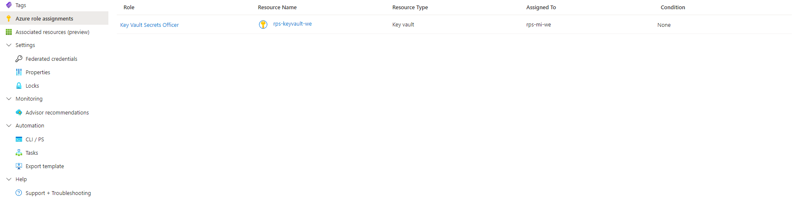
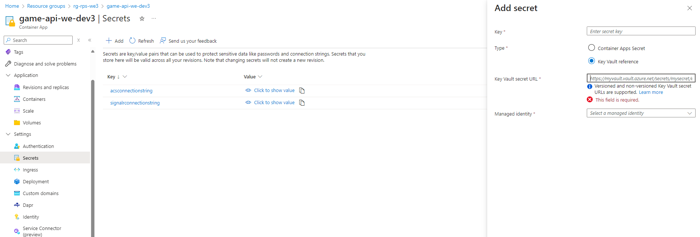

# Exercise 1

In this exercise, you will create an Azure Key Vault to securely store API endpoints as secrets, assign appropriate access roles, and set up a Managed Identity. You will then link these secrets to a game API container, ensuring the environment variables are securely configured, and deploy the containerized game application using Azure CLI.

## Estimated time: TODO minutes

## Learning objectives

- Create and Configure Azure Key Vault
- Assign Roles for Secure Access
- Manage and Add Secrets to Key Vault
- Set Up Managed Identity for Secure Access
- Use Secrets in a Game API Container
- Deploy and Configure a Container Application

## Prerequisites

During this module you will also need 7 of the PowerShell variables used previously:

- $signalrEndpoint - SignalR connection string
- $apiResourceGroup - name of the Resource Group in which you have your Container APIs and Static Web App, from the first region
- $smtp - connection string of your Azure Communication Service deployed in Module 2
- $gameApi - name of the Game Container API deployed in the first region
- $senderDnR - Azure Managed Domain MailFrom address
- $gameContainerUrl -  URL for your Game Container API
- $botContainerUrl - URL for your Bot Container API

## Step 1: Create an Azure Key Vault

Choose a name for your KeyVault and follow the commands from the .ps1 file

## Step 2: Assign Roles for Key Vault Access

Assign the necessary roles to allow access to the Key Vault.

### 2.1. Define your subscription information

### 2.2 Create a role assignment for Key Vault Secrets Officer

## Step 3: Add Your Endpoints as Secrets to the Key Vault

Store your endpoints as secrets in the Key Vault:

### 3.1 Add the SignalR endpoint as a secret

### 3.2 Add the ACS (SMTP) endpoint as a secret

## Step 4: Create a Managed Identity and Assign Roles

A Managed Identity is a secure way to authenticate with Azure services. You will create a Managed Identity and assign it the necessary roles to access the Key Vault.

### 4.1 Create a Managed Identity using the script

[Exercise1.ps1](./Exercise1.ps1)

### 4.2 Using [Azure Portal](https://portal.azure.com/)

- Navigate to Azure role assignments.
- Create a new role assignment for the Key Vault named **Key Vault Secrets Officer** and assign it to your Managed Identity.

### 4.3 Associate the Managed Identity with the Game API Container

1. In the Game API container, navigate to the **Identity** tab.
2. Select user-assigned identity and add the Managed Identity you created.

The container app now has permission to use the access granted to the Managed Identity, which includes access to the Key Vault secrets.

## Step 5: Use Key Vault Secrets in the Game API Container

We will now configure the Game API container to use the secrets stored in the Key Vault by adding them as secrets to the container.

We store a reference to the secret in the Key Vault in the container secrets section.
The container will use the access given to the managed identity to retrieve the secret from the Key Vault.

### 5.1 Using [Azure Portal](https://portal.azure.com/)

- Go to the **Secrets** section under the settings tab of your Key Vault.
- Add a secret named **acsconnectionstring**.
  - For the Key Vault Secret URL, copy the URL of the ACS secret you created.
  - Link it to the Managed Identity created in the previous step.
- Repeat the process for **signalrconnectionstring** to add your SignalR endpoint secret.

### 5.2 Use the .ps1 command to apply the secrets as environment variables for your game API container

The game API container will now use an environment variable to tell it what secrets it should use.

[Exercise1.ps1](./Exercise1.ps1)