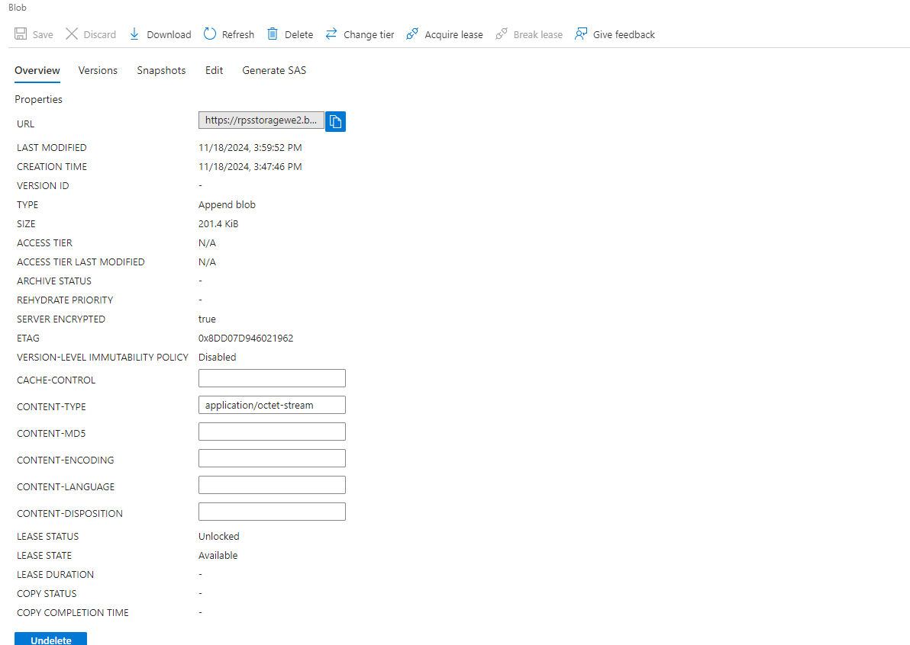

# Exercise 2

In this exercise, you will learn how to create an Azure Storage Account and configure your Azure Container App environment to send logs to Azure Monitor. You will then set up diagnostic settings to archive these logs to your storage account. Finally, you will generate and access the logs, exploring how to download and view them for analysis. This process helps in understanding how to monitor and troubleshoot containerized applications using Azure’s logging and monitoring features.

## Estimated time: TODO minutes

## Learning objectives

- Create and Configure an Azure Storage Account.
- Enable Logging for Azure Container Apps.
- Set Up Diagnostic Settings in Azure Portal.
- Access and Analyze Logs.
- Understand Logging and Monitoring Best Practices.

## Prerequisites

During this module you will also need 3 of the PowerShell variables used previously:

- $location - Azure region where you created your first api resource group.
- $apiResourceGroup - Name of the Resource Group in which you have your Container APIs and Static Web App, from the first region.
- $managedEnvironment - Name of your Managed Environment for containers in the API Resource Group.

## Step 1: Create a Storage Account and Update the Container App Environment

### 1.1 Create the storage account

### 1.2 Update the Container App environment to send logs to Azure Monitor

## Step 2: Configure Diagnostic Settings in Azure Portal

### 2.1. Using [Azure Portal](https://portal.azure.com/)

- Go to your **Managed Environment** to set diagnostics for the whole thing.
- Under the **Monitoring** section, click on **Diagnostic settings**.
- Add a new diagnostic setting and configure it as follows:
  - Select **all log categories**.
  - Choose **Archive to a storage account**.
  - Select the storage account you created earlier.

### 2.1. View Your Logs

- Play a game in your app to generate some logs.
- Then, navigate to your **Storage Account** in the Azure Portal.
- Under the **Data storage** section, go to the **Containers** tab.
- Open the **console-logs** container and browse until you find the JSON files containing your logs.
- Download the JSON file and view its contents to analyze the logs.

